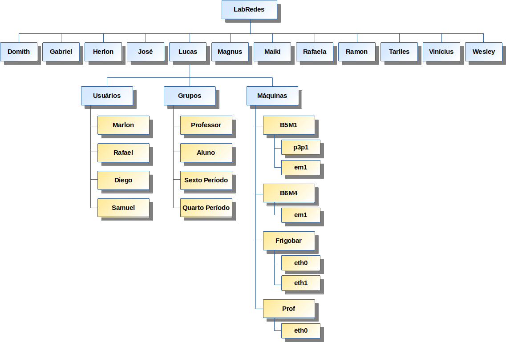

# Kerberos + LDAP + NFS

Instituto Federal do Sudeste de Minas Gerais - Campus Barbacena  
Curso: Tecnologia em Sistemas  para Internet  
Disciplina: Gerência e Configuração de Serviços Internet  
Prof. Herlon Ayres Camargo

## 1. Introdução

Este relatório tem o objetivo de apresentar as configurações em servidores linux para o funcionamento do Kerberos integrado a uma base de dados LDAP.  Será realizada também a configuração de um host para autenticação no servidor Kerberos e uso de diretório compartilhado utilizando NFS, diretório que estará localizado no mesmo servidor. Em todas as máquinas configuradas foi utilizado o sistema operacional CentOS 7. 

As configurações que serão realizadas neste relatório utiliza uma base de dados já existente. Será utilizado os usuários e hosts cadastrados na base LDAP do Laborátório de Redes do IF Sudeste MG - Campus Barbacena. Por isso, relacionado a base LDAP serão mostradas apenas as configurações necessárias para a integração com o Kerberos. A estrutura da base de dados do Laboratório de Redes se encontra da seguinte forma:



A partir disto, será utilizado os ramos Usuários e Máquinas, onde cada ramo pode ser referenciado da seguinte forma:  


## **2. Configurações Iniciais**

Será utilizado hostnames para referenciar aos servidores LDAP e Kerberos e aos hosts que utilizarão as aplicações. Sendo assim, os seguintes nomes serão utilizados.


```bash

200.131.10.180      ldap.labredes.info            ldap
10.3.2.1            kerberos.labredes.info        kerberos
10.3.2.3            b5m1.labredes.info            b5m1
10.3.2.4            b6m4.labredes.info            b6m4
```


Em todas as máquinas foi utilizado as configurações acima inseridas no arquivo **/etc/hosts**.

## 3. Servidor LDAP

É preciso instalar o pacote **krb5-server-ldap** na máquina em que se encontra o LDAP apenas para obter o schema do Kerberos.

```bash
$ yum install krb5-server-ldap
```

Copie o schema do kerberos para o diretório do LDAP que mantém todos os seus schemas.

```bash
cp /usr/share/doc/krb5-server-ldap-1.15.1/kerberos.schema /etc/openldap/schema/
```

Os diretório **/ldifs**  criado abaixo é apenas para organização, neles serão criados arquivos ldifs e arquivos temporários necessários para a conversão do esquema Kerberos em um arquivo ldif.

```bash
$ mkdir -p /ldifs
```

Após criado o diretório, crie um arquivo chamado **schema\_convert.conf** que manterá todos os schemas utilizados pelo LDAP.  


```bash
include /etc/openldap/schema/core.schema
include /etc/openldap/schema/collective.schema
include /etc/openldap/schema/corba.schema
include /etc/openldap/schema/cosine.schema
include /etc/openldap/schema/duaconf.schema
include /etc/openldap/schema/dyngroup.schema
include /etc/openldap/schema/inetorgperson.schema
include /etc/openldap/schema/java.schema
include /etc/openldap/schema/misc.schema
include /etc/openldap/schema/nis.schema
include /etc/openldap/schema/openldap.schema
include /etc/openldap/schema/ppolicy.schema
include /etc/openldap/schema/kerberos.schema
```


Após criado o arquivo **schema\_convert.conf** acima utilize o comando abaixo para gerar o ldif do schema Kerberos.

```bash
$ slapcat -f /ldifs/schema_convert.conf -F /ldifs/ -n0 -s "cn=kerberos,cn=schema,cn=config" > /ldifs/kerberos.ldif
```

É preciso excluir algumas linhas do arquivo que foi gerado acima. Remova as linhas do arquivo que são mostradas na exemplo abaixo.


```bash
# Linhas que devem ser removidas
structuralObjectClass: olcSchemaConfig
entryUUID: d3686f04-a2b0-1039-8d1d-e12728ae86c4
creatorsName: cn=config
createTimestamp: 20191124024949Z
entryCSN: 20191124024949.223922Z#000000#000#000000
modifiersName: cn=config
modifyTimestamp: 20191124024949Z
```


Após a remoção o arquivo deverá ficar como no exemplo simplificado abaixo.


```bash
dn: cn=kerberos,cn=schema,cn=config
objectClass: olcSchemaConfig
cn: kerberos

...

olcObjectClasses: {11}( 2.16.840.1.113719.1.301.6.17.1 
 NAME 'krbTicketPolicy' SUP top STRUCTURAL MUST cn )
```


Após criado o arquivo **kerberos.ldif** _****_o mesmo poderá ser adicionado ao LDAP. Utilize o comando abaixo para adicionar o novo schema com o servidor LDAP em funcionamento.

```bash
$ ldapadd -Y EXTERNAL -H ldapi:/// -f /ldifs/kerberos.ldif
```

Por motivos de segurança é recomendado inserir nova regra de acesso para os atributos utilizados pelo Kerberos. Desta forma, apenas o administrador da base consegue alterá-los. Será criado o arquivo abaixo para fazer as modificações nas configurações do LDAP.


```bash
dn: olcDatabase={2}hdb,cn=config
changetype: modify
add: olcDBIndex
olcDBIndex: krbPrincipalName eq,pres,sub
- 
add: olcAccess
olcAccess: to attrs=userPassword,shadowLastChange,krbPrincipalKey 
 by dn="cn=admin,dc=domith,dc=labredes,dc=info" write 
 by anonymous auth by self write 
 by * none

```


Aplicando as novas configurações de regra de acesso na base de dados.

```bash
$ ldapmodify -Y EXTERNAL -H ldapi:/// -f /ldifs/hdb_ajuste.ldif
```

Estas são as mínimas modificações necessárias no LDAP para integrá-lo como base de dados para o Kerberos. Como pode ser visto acima, não será utilizado nenhuma co

## 4. Servidor Kerberos

### 4.1 Adicionar Base de Dados LDAP

Como os usuários não estão cadastrados localmente e posteriormente será preciso criar um diretório home para cada usuário, para que assim eles possam obter o seu diretório pessoal a partir do NFS, é preciso antes configurar o LDAP como uma nova fonte de busca de usuários e grupos.  

```bash
$ yum install nss-pam-ldapd openldap-clients
```

Altere o arquivo **/etc/nsswitch.conf** para que as usuários, senhas e grupos sejam consultados também a partir da base LDAP e não apenas localmente.


```bash
passwd:     files sss ldap
shadow:     files sss ldap
group:      files sss ldap
...
netgroup:   files sss ldap
...
automount:  files ldap
```


```bash
$ systemctl start nscd
$ systemctl enable nscd
```

Acrescente no arquivo **/etc/nslcd.conf**  _****_as informações necessárias para consulta na base LDAP. Informe o endereço do servidor, o ramo da base onde estão os usuários e grupos, o usuário que tem a permissão de consultar a base e a sua senha. 


```bash
uid nslcd
gid ldap

# Endereço do servidor LDAP e ramo onde estão localizados 
# os usuários.
uri ldap://ldap.labredes.info/
base dc=domith,dc=labredes,dc=info

# Administrador da ramo e senha.
binddn cn=admin,dc=domith,dc=labredes,dc=info
bindpw domith

# Não será utilado comunicação TLS. Mas por padrão o 
# caminho do certificado é informado e assim foi mantido.
ssl no
tls_cacertdir /etc/openldap/cacerts
```


```bash
$ systemctl start nslcd
$ systemctl enable nslcd
```

Após iniciar o **nscd** e **nslcd** é o sistema deve ser capaz de verificar os usuários cadastrados na base LDAP. Para testar utilize o comando **getent passwd**, ****onde ****é exibido todos os usuários cadastrados localmente e também na novas fontes configuradas. Abaixo é realizado uma consulta com um usuário e um grupo armazenado na base de dados LDAP.

```bash
$ getent passwd marlon
    marlon:x:10001:10001:marlon:/home/marlon:/bin/bash
$ getent group rafael
    rafael:*:10002:
```

Estas configurações realizadas também precisarão ser feitas em cada host que que for utilizar a autenticação com o Kerberos e o compartilhamento de diretórios NFS.

### 4.2 Configurar Kerberos Server

```bash
$ yum install krb5-server krb5-workstation krb5-server-ldap 
$ yum install openldap-clients
```

É preciso configurar o servidor KDC  e Kadmin do Kerberos, ambos estarão na mesma máquina, **kerberos.labredes.info**. E também, é necessário inserir alguns atributos que configuram o serviço para utilizar a base de dados na máquina  **ldap.labredes.info**. O nome do reino a ser utilizado será **LABREDES.INFO.**


```bash
includedir /etc/krb5.conf.d/

[logging]
 default = FILE:/var/log/krb5libs.log
 kdc = FILE:/var/log/krb5kdc.log
 admin_server = FILE:/var/log/kadmind.log

[libdefaults]
 dns_lookup_realm = false
 ticket_lifetime = 24h
 renew_lifetime = 7d
 forwardable = true
 rdns = false
 pkinit_anchors = /etc/pki/tls/certs/ca-bundle.crt
 default_realm = LABREDES.INFO
 default_ccache_name = KEYRING:persistent:%{uid}

[realms]
 LABREDES.INFO = {
  kdc = kerberos.labredes.info
  admin_server = kerberos.labredes.info
  default_domain = labredes.info
  database_module = ldap.labredes.info
 }

[domain_realm]
 .labredes.info = LABREDES.INFO
 labredes.info = LABREDES.INFO

[dbdefaults]
 # CN que será criada posteriormente para armazenar dados do Kerberos
 ldap_kerberos_container_dn = cn=krbContainer,dc=domith,dc=labredes,dc=info

[dbmodules]
 ldap.labredes.info = {
  db_library = kldap
  
  # Usuário que o Kerberos utilizará para se autenticar e poder
  # consultar ou editar o ramo "dc=domith,dc=labredes,dc=info".
  ldap_kdc_dn = "cn=admin,dc=domith,dc=labredes,dc=info"
  ldap_kadmind_dn = "cn=admin,dc=domith,dc=labredes,dc=info"
  
  # Arquivo que irá armazenar a senha do admin acima citado.
  # Será criado posteriormente.
  ldap_service_password_file = /var/kerberos/krb5kdc/service.keyfile
  ldap_servers = ldap://ldap.labredes.info
  ldap_conns_per_server = 5
 }

```


O novo reino configurado acima, **LABREDES.INFO**, é referenciado em mais dois arquivos do Kerberos. Neles serão alterados apenas o nome do reino. A configuração dos dois arquivos se encontram abaixo.


```bash
kdc_ports = 88
kdc_tcp_ports = 88

[realms]
 LABREDES.INFO = {
  #master_key_type = aes256-cts
  acl_file = /var/kerberos/krb5kdc/kadm5.acl
  dict_file = /usr/share/dict/words
  admin_keytab = /var/kerberos/krb5kdc/kadm5.keytab
  supported_enctypes = aes256-cts:normal aes128-cts:normal des3-hmac-sha1:normal arcfour-hmac:normal camellia256-cts:normal camellia128-cts:normal des-hmac-sha1:normal des-cbc-md5:normal des-cbc-crc:normal
}

```



```bash
*/admin@LABREDES.INFO	    *
```


O ****ramo onde será armazenado as dependências do Kerberos, configurado em **krb5.conf,** no atributo **ldap\_kerberos\_container\_dn**, precisa ser criado manualmente na base LDAP. Os usuários que irão se autenticar com o Kerberos serão armazenados neste ramo por padrão.

Neste relatório serão utilizados usuários e hosts que estarão previamente armazenados na base LDAP, por isso eles estarão salvos em outro ramo, e não em **krbContainer**. No momento em que for criado novos usuários e hosts no Kerberos será mostrado como referenciá-los em outro ramo. Mas antes, é preciso cria o **krbContainer** no ramo "dc=domith,dc=labredes,dc=info".

```bash
$ kdb5_ldap_util -D cn=admin,dc=domith,dc=labredes,dc=info create -subtrees dc=domith,dc=labredes,dc=info -r LABREDES.INFO -s -H ldap://ldap.labredes.info
```

É preciso gerar o arquivo que armazenará a senha do administrador da base "dc=domith",  que será utilizada pelo Kerberos. O arquivo deverá estar localizado no mesmo diretório configurado no arquivo **krb5.conf**, **ldap\_service\_password\_file**.

```bash
$ kdb5_ldap_util -D cn=admin,dc=domith,dc=labredes,dc=info stashsrvpw -f /var/kerberos/krb5kdc/service.keyfile cn=admin,dc=domith,dc=labredes,dc=info
```

O serviço pode ser iniciado e habilitado para iniciar com o sistema. Mas ainda é preciso criar uma senha para os usuários e cadastrar hosts no Kerberos.

```bash
$ systemctl start kadmin.service
$ systemctl start krb5kdc.service

$ systemctl enable kadmin.service
$ systemctl enable krb5kdc.service
```

### 4.3 Cadastrar Usuários no Kerberos

Como foi dito, serão utilizados usuários previamente cadastrados na base LDAP e por isso abaixo é cadastrado um novo usuário no Kerberos com a referência do seu ramo na base. Sendo assim, o Kerberos irá armazenar os atributos  **krbPrincipalName**, **krbPrincipalKey** e outros que serão usados na autenticação do usuário. Caso não seja passado a referência do usuário um novo será criado no ramo "cn=krbContainer,dc=domith,dc=labredes,dc=info".

```bash
$ kadmin.local 
    Authenticating as principal root/admin@LABREDES.INFO 
    with password.
    
    # Adicionar o usuário marlon
    kadmin.local:  addprinc -x dn="uid=marlon,ou=Usuarios,
    dc=domith,dc=labredes,dc=info" marlon
    ------------------------    
    WARNING: no policy specified for marlon@LABREDES.INFO; 
    defaulting to no policy
    Enter password for principal "marlon@LABREDES.INFO": 
    Re-enter password for principal "marlon@LABREDES.INFO": 
    Principal "marlon@LABREDES.INFO" created.
    
    # Adicionar o usuário rafael
    kadmin.local:  addprinc -x dn="uid=rafael,ou=Usuarios,
    dc=domith,dc=labredes,dc=info" rafael
    ------------------------    
    WARNING: no policy specified for rafael@LABREDES.INFO; 
    defaulting to no policy
    Enter password for principal "rafael@LABREDES.INFO": 
    Re-enter password for principal "rafael@LABREDES.INFO": 
    Principal "rafael@LABREDES.INFO" created.
    
    # Listar hosts e usuários cadastradas
    kadmin.local: listprincs
    ------------------------
    marlon@LABREDES.INFO
    rafael@LABREDES.INFO
    K/M@LABREDES.INFO
    krbtgt/LABREDES.INFO@LABREDES.INFO
    ...
        
    # Sair do console kadmin.local
    kadmin.local:  quit
    
```

### 4.4 Cadastrar Hosts no Kerberos

A partir do comando **kadmin.local** crie um novo host autorizado no Kerberos e após isso, crie também um arquivo **\*.keytab** referente ao host. Este arquivo será copiado posteriormente para o host correspondente.

```bash
$ kadmin.local 
    Authenticating as principal root/admin@LABREDES.INFO with
    password.
    
    # Criar um novo host nfs
    kadmin.local: addprinc -randkey -x dn="cn=b5m1,ou=Maquinas,
    dc=domith,dc=labredes,dc=info" nfs/b5m1.labredes.info
    ------------------------
    WARNING: no policy specified for 
        nfs/b5m1.labredes.info@LABREDES.INFO; defaulting
        to no policy
    Principal "nfs/b5m1.labredes.info@LABREDES.INFO" created.
    
    # Gerar keytab do host nfs
    kadmin.local: ktadd -k /tmp/b5m1.keytab nfs/b5m1.labredes.info 
    ------------------------
    Entry for principal nfs/b5m1.labredes.info with kvno 2, 
        encryption type aes256-cts-hmac-sha1-96 added 
        to keytab WRFILE:/tmp/b5m1.keytab.
    Entry for principal nfs/b5m1.labredes.info with kvno 2, 
        encryption type des-cbc-md5 added 
        to keytab WRFILE:/tmp/b5m1.keytab.
    ...
    
    # É preciso cadastrar o próprio host servidor para 
    # funcionamento correto do nfs.
    kadmin.local: addprinc -randkey -x dn="cn=kerberos,ou=Maquinas,
    dc=domith,dc=labredes,dc=info" nfs/kerberos.labredes.info
    ------------------------
    WARNING: no policy specified for 
        nfs/kerberos.labredes.info@LABREDES.INFO; defaulting
        to no policy
    Principal "nfs/kerberos.labredes.info@LABREDES.INFO" created.
    
    # Gerar keytab do host nfs
    kadmin.local: ktadd -k /tmp/kerberos.keytab nfs/kerberos.labredes.info 
    ------------------------
    Entry for principal nfs/kerberos.labredes.info with kvno 2, 
        encryption type aes256-cts-hmac-sha1-96 added 
        to keytab WRFILE:/tmp/kerberos.keytab.
    Entry for principal nfs/kerberos.labredes.info with kvno 2, 
        encryption type des-cbc-md5 added 
        to keytab WRFILE:/tmp/kerberos.keytab.
    ...
    
    # Listar hosts e usuários cadastradas
    kadmin.local: listprincs
    ------------------------
    marlon@LABREDES.INFO
    rafael@LABREDES.INFO
    nfs/b5m1.labredes.info@LABREDES.INFO
    K/M@LABREDES.INFO
    krbtgt/LABREDES.INFO@LABREDES.INFO
    ...

    # Sair do console kadmin.local
    kadmin.local:  quit
```

Utilize o console **ktutil** para adicionar a chave do servidor Kerberos que foi gerada acima. A chave do host **b5m1** é adicionada apenas no **tópico 5.1**, quando é feita as configurações no host.

```bash
$ ktutil
   ktutil:  rkt /tmp/kerberos.keytab 
   ktutil:  wkt /etc/krb5.keytab
   ktutil:  list
   ------------------------
   slot KVNO Principal
   ---- ---- -----------------------------------------
      1    2   nfs/kerberos.labredes.info@LABREDES.INFO
      2    2   nfs/kerberos.labredes.info@LABREDES.INFO
      ...
      8    2   nfs/kerberos.labredes.info@LABREDES.INFO
   
   # Sair do console kadmin.local
   ktutil:  quit
   
```

### 4.5 Configurar NFS Server

```bash
$ yum install nfs-utils 
```

Crie o arquivo **/etc/exports** que será utilizado para configurar os diretórios que serão compartilhado pelo NFS.


```bash
/home    *(rw,sync,no_subtree_check,sec=krb5)
```


Inicie o serviços para o funcionamento do NFS.

```bash
$ systemctl start rpcbind
$ systemctl start nfs-server

$ systemctl enable rpcbind
$ systemctl enable nfs-server
```

Após as configurações realizadas é possível verificar os diretórios compartilhados pelo NFS, basta utilizar o comando abaixo que os mesmos serão listados.

```bash
$ showmount -e
    Export list for kerberos.labredes.info:
    /home *
```

Crie um diretório home para cada usuário que poderá logar nos hosts. Caso isso não seja feito o usuário não poderá acessar o seu diretório pessoal, pois ele não existirá. Abaixo é mostrado um exemplo para criar o diretório home do usuário **marlon**.

```bash
$ mkdir /home/marlon
$ cp /etc/skel/.bash* /home/marlon
```

É preciso alterar as permissões e dono do diretório home do usuário. Caso as configurações do **tópico 4.1** terem sido realizadas corretamente, será possível fazer as alterações abaixo.

```bash
$ chown -R marlon:marlon /home/marlon
$ chmod 700 /home/marlon
```

## 5. Host Com NFS e Autenticação Via Kerberos 

Neste momento deve ser acessado o host que permitirá ao usuário se autenticar através no Kerberos e após isso acessar o seu diretório pessoal através do NFS. Será utilizado a máquina endereçada como **b5m1.labredes.info** para demonstrar as configurações que precisam ser realizadas.

### 5.1 Configurar Kerberos Workstation

```bash
$ yum install krb5-workstation 
```

Copie o arquivo **\*.keytab** correspondente ao host que está sendo configurado. O arquivo foi criado após cadastrar um novo host no Kerberos, na sessão 3.4 deste relatório.

```bash
$ scp root@kerberos.labredes.info:/tmp/b5m1.keytab /tmp/
```

Utilize o console **ktutil** para adicionar a chave do host, como é realizado abaixo para este host que está sendo configurado.

```bash
$ ktutil
   ktutil:  rkt /tmp/b5m1.keytab 
   ktutil:  wkt /etc/krb5.keytab
   ktutil:  list
   ------------------------
   slot KVNO Principal
   ---- ---- -----------------------------------------
      1    2   nfs/b5m1.labredes.info@LABREDES.INFO
      2    2   nfs/b5m1.labredes.info@LABREDES.INFO
      ...
      8    2   nfs/b5m1.labredes.info@LABREDES.INFO
   
   # Sair do console kadmin.local
   ktutil:  quit
   
```

### 5.2 Configurar PAM

```bash
$ yum install nss-pam-ldapd pam_krb5 openldap-clients
```

Copie as configurações do Kerberos no servidor para que sejam utilizadas também pelo Kerberos cliente.  

```bash
$ scp root@kerberos.labredes.info:/etc/krb5.conf /etc/
```

Utilize o comando abaixo para habilitar o Kerberos como método de autenticação no sistema.

```bash
$ authconfig --updateall --enablekrb5
```


É preciso adicionar a base de dados LDAP como fonte de usuários e grupos. Utilize as mesmas configurações realizadas no tópico [**4.1 Adicionar Base de Dados LDAP**](https://app.gitbook.com/@guilhermedomith/s/kerberos-ldap-nfs/~/drafts/-LvDe-npE5uTGWO7pQwX/#4-1-adicionar-base-de-dados-ldap). Caso não seja feito, não será possível logar com os usuários no host.


### 5.3 Configurar NFS

```bash
$ yum install nfs-utils autofs
```

Altere o configuração no arquivo **/etc/auto.master** para informar o local onde será montado os diretórios compartilhados pelo servidor.


```bash
# Configurações padrão
/misc   /etc/auto.misc
/net    -hosts
+dir:/etc/auto.master.d
+auto.master

# Acrescente esta configuração
/home /etc/auto.autofs --timeout=600
```


O arquivo referenciado nas configurações acima precisa ser criado. Crie e acrescente as configurações como no exemplo abaixo, onde informa que será montado o diretório home do usuário logado.


```bash
*    -fstype=nfs4,sec=krb5   kerberos.labredes.info:/home/&
```


```bash
$ systemctl start autofs
$ systemctl enable autofs

$ systemctl restart nfs-client.target
$ systemctl enable nfs-client.target
```

Após habilitar o NFS o sistema estará apto para obter os diretórios compartilhados pelo servidor. Para utiliza-los é preciso logar na máquina com algum dos usuários cadastrados no Kerberos. Após o login com o usuário utilize o comando abaixo para verificar o local onde o diretório home do usuário está fisicamente armazenado.

```bash
$ mount | grep marlon
    kerberos.labredes.info:/home/marlon on /home/marlon type 
    nfs4 (rw,relatime,vers=4.1,rsize=262144,wsize=262144,namlen=255,
    hard,proto=tcp,port=0,timeo=600,retrans=2,sec=sys,clientaddr=10.3.2.3,
    local_lock=none,addr=10.3.2.1)
```

Ainda com o usuário autenticado pelo Kerberos logado no sistema, utilize o comando abaixo para listar os tickes do usuário recebido do Kerberos.

```bash
$ klist 
    Ticket cache: KEYRING:persistent:10001:krb_ccache_rsyS6WA
    Default principal: marlon@LABREDES.INFO
    
    Valid starting       Expires              Service principal
    25-11-2019 00:02:22  26-11-2019 00:02:22  krbtgt/LABREDES.INFO@LABREDES.INFO
```

## 6. Referências

**Kerberos, OpenLDAP and NFS**. 2018. Disponível em: &lt;[https://www.youtube.com/playlist?list=PL34sAs7\_26wPWa0O244eBv0tcg1MSJMp4](https://www.youtube.com/playlist?list=PL34sAs7_26wPWa0O244eBv0tcg1MSJMp4)&gt;.

JÚNIOR, Wagner de Almeida. **Kerberos com Backend LDAP: Análise e Implantação.** Disponível em: &lt;[http://repositorio.ufla.br/jspui/handle/1/5517](http://repositorio.ufla.br/jspui/handle/1/5517)&gt;

GIL, Anahuac de Paula. **OpenLDAP Extreme**. Rio de Janeiro: BRASPORT, 2012.

&lt;[https://help.ubuntu.com/community/NFSv4Howto\#NFSv4\_and\_Autofs](https://help.ubuntu.com/community/NFSv4Howto#NFSv4_and_Autofs)&gt;

&lt;[https://wiki.debian.org/NFS/Kerberos](https://wiki.debian.org/NFS/Kerberos)&gt;

&lt;[https://codingbee.net/rhce/nfs-use-kerberos-to-control-nfs-access-on-centos-7](https://codingbee.net/rhce/nfs-use-kerberos-to-control-nfs-access-on-centos-7)&gt;


